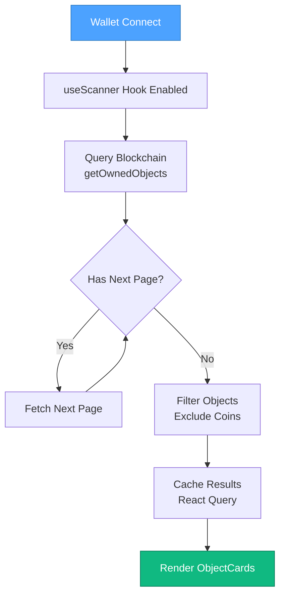
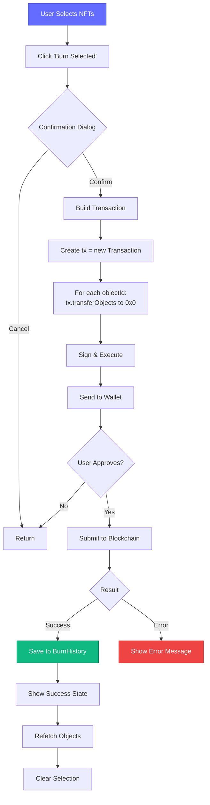
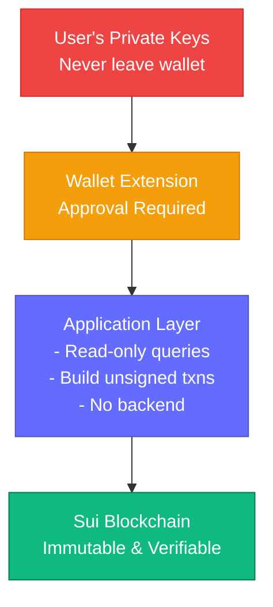

# Architecture Documentation

## Table of Contents

- [Overview](#overview)
- [System Design](#system-design)
- [Component Architecture](#component-architecture)
- [Data Flow](#data-flow)
- [State Management](#state-management)
- [Blockchain Integration](#blockchain-integration)
- [Performance Considerations](#performance-considerations)
- [Security Architecture](#security-architecture)

## Overview

Sui Wallet Cleanup is a client-side React application that interfaces with the Sui blockchain to provide NFT management capabilities. The architecture follows modern React patterns with hooks, leverages the Sui SDK for blockchain interactions, and maintains a clean separation of concerns.

### Design Principles

1. **Client-Side First**: No backend required, all operations in browser
2. **Type Safety**: TypeScript throughout for reliability
3. **Performance**: Optimized rendering and lazy loading
4. **User Privacy**: No data collection, local storage only
5. **Network Agnostic**: Works on Mainnet and Testnet

## System Design

### High-Level Architecture

```mermaid
graph TB
    subgraph Browser["User's Browser"]
        subgraph React["React Application (Vite)"]
            Router[Router<br/>Home, Mint,<br/>History, Docs]
            Components[Components<br/>Scanner, Minter,<br/>Navbar, Cards]
            Hooks[Hooks<br/>useScanner<br/>useSignAndExecute]
        end

        subgraph State["State Management"]
            RQ[@tanstack/react-query<br/>Server State]
            LS[LocalStorage<br/>Burn History]
        end

        subgraph SDK["Sui SDK (@mysten/dapp-kit)"]
            WP[WalletProvider]
            SCP[SuiClientProvider]
            TB[Transaction Builder]
        end

        Wallet[Wallet Extension<br/>Sui Wallet/Ethos]
    end

    subgraph Blockchain["Sui Blockchain Network"]
        subgraph Networks["Networks"]
            TN[Testnet]
            MN[Mainnet]
            RPC[RPC Node]
        end

        subgraph Contracts["Smart Contracts (Move)"]
            NFTMinter[NFT Minter<br/>testnet_nft module]
            SuiFramework[Sui Framework<br/>transfer, burn]
        end
    end

    Router --> Components
    Components --> Hooks
    Hooks --> RQ
    Hooks --> LS
    Hooks --> SDK
    SDK --> Wallet
    Wallet -.->|Sign Txns| SDK
    SDK --> RPC
    RPC --> TN
    RPC --> MN
    SDK --> Contracts

    style React fill:#646CFF,stroke:#4C51BF,color:#fff
    style SDK fill:#4CA2FF,stroke:#2E7BC0,color:#fff
    style Contracts fill:#10B981,stroke:#047857,color:#fff
```

## Component Architecture

### Component Tree

```
App (Root)
├── QueryClientProvider
│   └── SuiClientProvider
│       └── WalletProvider
│           └── BrowserRouter
│               ├── Navbar
│               │   ├── Logo & Branding
│               │   ├── Navigation Links
│               │   ├── Network Selector
│               │   └── WalletConnection
│               └── Routes
│                   ├── HomePage
│                   │   ├── Hero
│                   │   ├── Scanner
│                   │   │   └── ObjectCard[] (dynamic)
│                   │   └── Features
│                   ├── MintPage
│                   │   └── Minter
│                   ├── HistoryPage
│                   │   └── BurnRecord[] (dynamic)
│                   └── DocsPage
```

### Key Components

#### 1. Scanner Component

**Purpose**: Displays and manages NFTs in the connected wallet

**Responsibilities**:

- Fetch wallet objects via `useScanner` hook
- Render object cards in responsive grid
- Handle multi-selection state
- Execute burn transactions
- Manage loading/error states

**State**:

- `selectedIds: Set<string>` - Selected NFT IDs
- `isBurning: boolean` - Burn operation status
- `burnStatus: 'idle' | 'success' | 'error'` - Transaction status

**Key Methods**:

```typescript
toggleSelection(id: string): void
handleBurn(): void
```

#### 2. Minter Component

**Purpose**: Create test NFTs for demonstration

**Responsibilities**:

- Collect NFT metadata (name, description, URL)
- Build mint transactions
- Execute via wallet
- Provide quick-fill templates

**State**:

- `name: string`
- `description: string`
- `imageUrl: string`
- `status: 'idle' | 'minting' | 'success' | 'error'`

**Key Methods**:

```typescript
mintNFT(): void
quickMintSpam(index: number): void
```

#### 3. ObjectCard Component

**Purpose**: Display individual NFT with metadata

**Props**:

```typescript
interface ObjectCardProps {
  object: SuiObjectResponse;
  isSelected: boolean;
  onToggle: (id: string) => void;
}
```

**Responsibilities**:

- Extract display metadata
- Show image with fallback
- Handle selection toggle
- Link to Suiscan explorer

### Custom Hooks

#### useScanner

**Purpose**: Fetch and manage wallet objects

```typescript
function useScanner() {
  const account = useCurrentAccount();
  const client = useSuiClient();

  return useQuery({
    queryKey: ["scanner", account?.address],
    enabled: !!account,
    queryFn: async () => {
      // Paginated fetch of all objects
      // Filter out coins
      // Return NFTs only
    },
  });
}
```

**Features**:

- Automatic fetching on wallet connection
- Pagination handling
- Coin filtering
- React Query caching

## Data Flow

### Object Scanning Flow



### Burn Transaction Flow



### State Management Strategy

#### Local State (useState)

- **Form inputs**: Minter fields, selection state
- **UI state**: Modals, dropdowns, loading states
- **Ephemeral data**: Current transaction status

#### React Query

- **Server state**: Blockchain data (objects, balances)
- **Caching**: Automatic with smart invalidation
- **Background refetch**: Keep data fresh
- **Loading states**: Built-in management

#### LocalStorage

- **Burn history**: Persistent across sessions
- **User preferences**: (Future: theme, settings)
- **Scoped to browser**: No cross-device sync

## Blockchain Integration

### Sui SDK Integration

```typescript
// Network Configuration
const { networkConfig } = createNetworkConfig({
  mainnet: {
    url: getJsonRpcFullnodeUrl('mainnet'),
    network: 'mainnet'
  },
  testnet: {
    url: getJsonRpcFullnodeUrl('testnet'),
    network: 'testnet'
  },
});

// Providers Hierarchy
<QueryClientProvider>
  <SuiClientProvider networks={networkConfig}>
    <WalletProvider autoConnect>
      {/* App Components */}
    </WalletProvider>
  </SuiClientProvider>
</QueryClientProvider>
```

### Transaction Building

#### Mint NFT Transaction

```typescript
const tx = new Transaction();

tx.moveCall({
  target: `${PACKAGE_ID}::testnet_nft::mint_to_sender`,
  arguments: [
    tx.pure.string(name),
    tx.pure.string(description),
    tx.pure.string(imageUrl),
  ],
});

signAndExecute({ transaction: tx });
```

#### Burn NFT Transaction

```typescript
const tx = new Transaction();

objectIds.forEach((id) => {
  tx.transferObjects(
    [tx.object(id)],
    "0x0000000000000000000000000000000000000000000000000000000000000000",
  );
});

signAndExecute({ transaction: tx });
```

### Wallet Integration

The app uses `@mysten/dapp-kit` for wallet connectivity:

- **Auto-detection**: Finds installed wallets
- **Multi-wallet**: Supports Sui Wallet, Ethos, etc.
- **Network sync**: Reads wallet's active network
- **Transaction signing**: Secure, user-approved only

## Performance Considerations

### Optimization Strategies

#### 1. Code Splitting

- Route-based splitting via React Router
- Lazy loading for heavy components
- Bundle size optimization

#### 2. Object Fetching

- Pagination to handle large wallets
- Incremental loading
- Smart caching with React Query

#### 3. Rendering

- Virtual scrolling for large lists (future)
- Memoization of expensive calculations
- Debounced search/filter operations

#### 4. Image Loading

- Lazy image loading
- Fallback placeholders
- Error handling for broken URLs

### Bundle Analysis

```
Current Production Build:
├── index.html           0.47 kB
├── index.css           44.53 kB (gzip: 7.83 kB)
└── index.js           583.76 kB (gzip: 186.54 kB)

Optimization Opportunities:
- Dynamic imports for pages
- Manual chunking for vendor code
- Tree-shaking unused utilities
```

## Security Architecture

### Security Model



### Security Features

#### 1. No Backend

- Client-side only architecture
- No server to compromise
- No API keys to steal

#### 2. Wallet Isolation

- Private keys never exposed
- Transaction signing in wallet
- User approval required

#### 3. Confirmation Dialogs

- Double-check destructive actions
- Clear transaction details
- Cancel option always available

#### 4. Type Safety

- TypeScript prevents runtime errors
- Validated inputs
- Safe object access

#### 5. Local Storage Only

- History stored in browser
- No cloud sync
- No third-party tracking

### Potential Risks & Mitigations

| Risk                       | Impact | Mitigation                       |
| -------------------------- | ------ | -------------------------------- |
| Malicious wallet extension | High   | Use official wallets only        |
| Accidental burn            | Medium | Confirmation dialogs             |
| XSS attacks                | Low    | React auto-escaping, CSP headers |
| Supply chain attack        | Medium | NPM audit, lock files            |
| Phishing                   | High   | Clear branding, official domain  |

## Future Enhancements

### Planned Architecture Improvements

1. **Enhanced Caching**
   - Service Worker for offline capability
   - IndexedDB for large datasets
   - Progressive Web App (PWA)

2. **Advanced Filtering**
   - Client-side search index
   - Tag-based organization
   - Collection grouping

3. **Analytics (Privacy-focused)**
   - Local-only statistics
   - No external tracking
   - Export/import data

4. **Mobile Optimization**
   - Touch-optimized UI
   - Reduced bundle size
   - Native app wrapper

---

**Last Updated**: February 2026  
**Version**: 1.0.0  
**Maintainers**: [Your Team]
