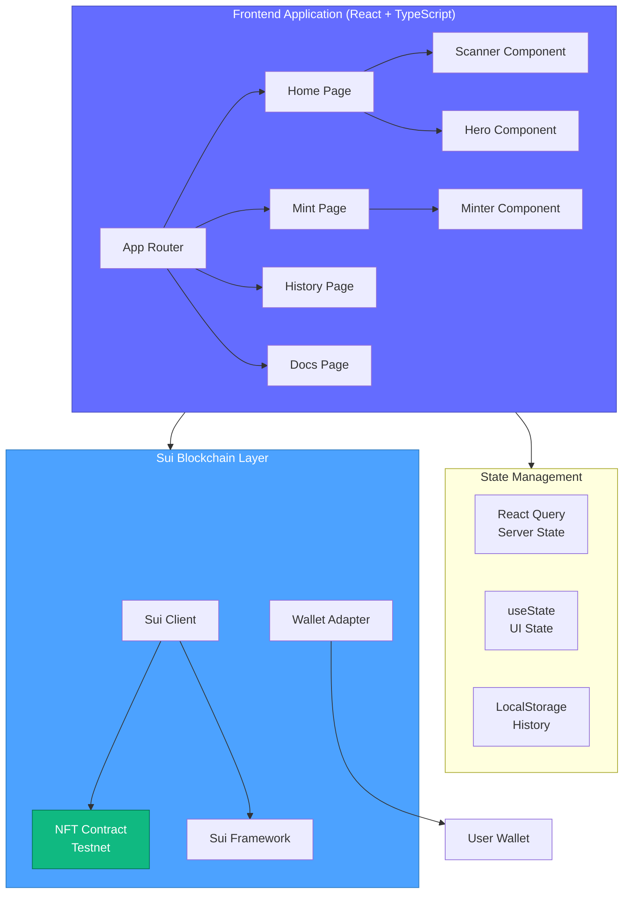
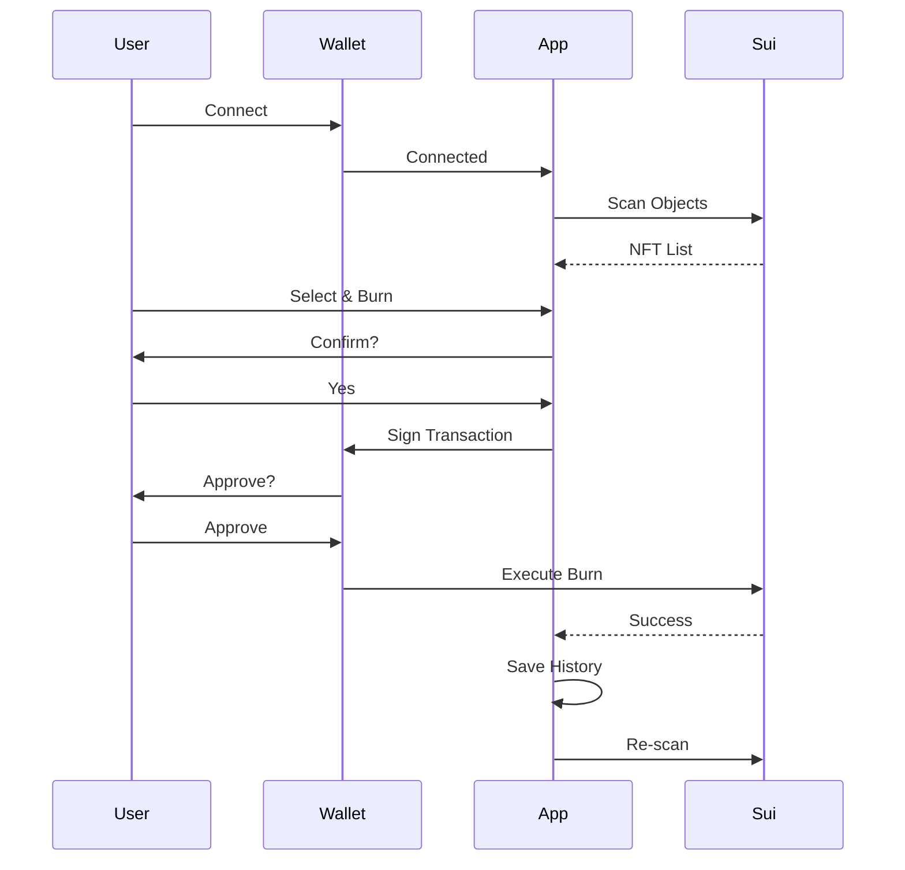

# Sui Wallet Cleanup 🧹✨

> **Clean Slate, Clean Wallet** - A professional-grade NFT management tool for the Sui blockchain ecosystem

[](https://sui.io)
[](https://www.typescriptlang.org/)
[](https://react.dev/)
[](https://vitejs.dev/)
[](LICENSE)

## 🚀 Live Demo

**Try it now**: [https://sui-wallet-cleanup.vercel.app/](https://sui-wallet-cleanup.vercel.app/)

> Connect your Sui wallet and start cleaning up unwanted NFTs in seconds!

## 📖 Table of Contents

- [Overview](#-overview)
- [Features](#-features)
- [System Architecture](#-system-architecture)
- [Getting Started](#-getting-started)
- [Smart Contract](#-smart-contract)
- [Tech Stack](#️-tech-stack)
- [Development](#-development)
- [Security](#-security)
- [Contributing](#-contributing)

## 🌟 Overview

**Sui Wallet Cleanup** helps Sui blockchain users combat wallet clutter from spam NFTs, unwanted airdrops, and scam tokens with an intuitive batch cleanup interface.

### The Problem

As Web3 adoption grows, users face wallet pollution from spam NFTs, scam tokens, and abandoned airdrops, reducing wallet usability and creating security risks.

### The Solution

A streamlined, secure application that:

- ✅ Automatically scans and displays all wallet objects
- ✅ Enables multi-select batch burning in a single transaction
- ✅ Tracks cleanup history with blockchain proof
- ✅ Provides testing tools for demonstrations

## ✨ Features

### 🔍 Smart Scanner

- Instantly scans connected wallet for all non-coin objects
- Beautiful, responsive card-based UI with NFT previews
- Real-time updates with network-aware Suiscan links

### 🗑️ Batch Cleanup Engine

- Multi-select interface with intuitive checkboxes
- One-click burn for all selected NFTs
- Confirmation dialogs prevent accidental deletions
- Gas-efficient batch processing

### 📊 History Tracking

- Comprehensive burn records with transaction digests
- Network separation (Mainnet/Testnet)
- Statistics dashboard with visual summaries
- Persistent browser storage (last 100 transactions)

### 🎨 Built-in Test Minter

- Quick-fill spam NFT templates for demos
- Custom NFT creation with metadata
- Instant Suiscan integration
- Zero configuration on Testnet

### 🌐 Network Support

- Seamless Mainnet/Testnet switching
- Auto-detection of wallet's active network
- No page refresh required

## 🏗️ System Architecture



### Data Flow



## 🚀 Getting Started

### Prerequisites

- Node.js 18.x+ and npm 9.x+
- [Sui Wallet](https://chrome.google.com/webstore/detail/sui-wallet) browser extension
- Testnet SUI from [faucet.sui.io](https://faucet.sui.io)

### Installation

```bash
# Clone repository
git clone https://github.com/yourusername/sui-wallet-cleanup.git
cd sui-wallet-cleanup

# Install dependencies
npm install

# Start development server
npm run dev

# Open http://localhost:5173
```

### Quick Start

1. **Connect Wallet** → Click "Connect Wallet" in navbar
2. **Switch to Testnet** → Select network from dropdown
3. **Scan Wallet** → Auto-loads on connection
4. **Clean Up** → Select NFTs → "Burn Selected" → Approve

## � Smart Contract

### NFT Minter (Testnet)

**Package ID**: `0x8a2992052324f906d79b2f9408c640cd1dde86e4acd85a0dc7317a1452539de9`  
**Module**: `testnet_nft`  
**Function**: `mint_to_sender(name, description, url)`

[View on Suiscan →](https://suiscan.xyz/testnet/object/0x8a2992052324f906d79b2f9408c640cd1dde86e4acd85a0dc7317a1452539de9)

### Burn Mechanism

NFTs are permanently removed by transferring to the zero address:

```typescript
tx.transferObjects(
  [tx.object(objectId)],
  "0x0000000000000000000000000000000000000000000000000000000000000000",
);
```

## 🛠️ Tech Stack

| Layer          | Technologies                                          |
| -------------- | ----------------------------------------------------- |
| **Frontend**   | React 18, TypeScript, Vite, React Router, TailwindCSS |
| **Blockchain** | Sui SDK, @mysten/dapp-kit, Move Language              |
| **State**      | @tanstack/react-query, useState, LocalStorage         |
| **Dev Tools**  | ESLint, TypeScript ESLint, PostCSS                    |

## 💻 Development

### Available Scripts

```bash
npm run dev       # Start development server
npm run build     # Build for production
npm run preview   # Preview production build
npm run lint      # Run linter
```

### Project Structure

```
sui-wallet-cleanup/
├── src/
│   ├── components/     # React components
│   ├── hooks/          # Custom hooks (useScanner)
│   ├── pages/          # Route pages
│   ├── utils/          # Utilities (burnHistory)
│   └── App.tsx         # Root component
├── test_nft_minter/    # Move smart contract
├── ARCHITECTURE.md     # Technical deep-dive
├── CONTRIBUTING.md     # Contribution guidelines
└── README.md           # This file
```

For detailed architecture, see [ARCHITECTURE.md](ARCHITECTURE.md)

## 🔐 Security

### Security Model

- ✅ **No Backend** - Client-side only, no server to compromise
- ✅ **No Private Keys** - Keys never leave wallet extension
- ✅ **User Approval** - Every transaction requires explicit consent
- ✅ **Confirmation Dialogs** - Double-check destructive actions
- ✅ **Type Safety** - TypeScript prevents runtime errors
- ✅ **Open Source** - Fully auditable code

### User Safety

⚠️ **Burn operations are permanent and irreversible**

- Always verify NFT details before burning
- Test on Testnet before using Mainnet
- Keep wallet extension updated

## 🤝 Contributing

We welcome contributions! See [CONTRIBUTING.md](CONTRIBUTING.md) for:

- Development setup
- Code style guidelines
- Commit conventions
- Pull request process

Quick contribution workflow:

```bash
git checkout -b feature/amazing-feature
# Make changes
git commit -m "feat: add amazing feature"
git push origin feature/amazing-feature
# Open Pull Request
```

## 📄 License

MIT License - see [LICENSE](LICENSE) file for details.

## 🙏 Acknowledgments

- Built with ❤️ for the Sui ecosystem
- Powered by [Sui](https://sui.io) and [Mysten Labs](https://mystenlabs.com)
- Community feedback and testing

## 📞 Support

- **Issues**: [GitHub Issues](https://github.com/yourusername/sui-wallet-cleanup/issues)
- **Discussions**: [GitHub Discussions](https://github.com/yourusername/sui-wallet-cleanup/discussions)

## 🗺️ Roadmap

- [ ] Multi-wallet support (Ethos, Suiet)
- [ ] Advanced filtering by collection
- [ ] Bulk export/import
- [ ] Mobile app version
- [ ] NFT marketplace integration

---

**Made with ❤️ for the Sui Community** | [Documentation](ARCHITECTURE.md) | [Contributing](CONTRIBUTING.md)

[⬆ Back to top](#sui-wallet-cleanup-)
